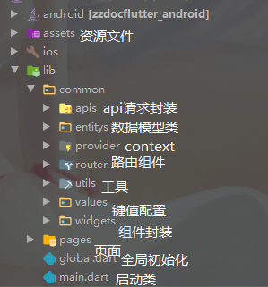

# EnglishManFlutter
一个简单的嘤语app

## 主要功能

### 注册登录

| 注册                                                         | 登录                                                         |
| ------------------------------------------------------------ | ------------------------------------------------------------ |
|  |  |

### 单词背诵

| 单词背诵                                                     | 单词背诵                                                     |
| ------------------------------------------------------------ | ------------------------------------------------------------ |
|  |  |

| 个人已背单词                                                 | 设置每日目标                                                 |
| ------------------------------------------------------------ | ------------------------------------------------------------ |
|  |  |

### 搜词

### 翻译

### 动态

## 项目结构

## 参考项目

- [英语数据库](https://github.com/skywind3000/ECDICT)
- [OCR识别](https://github.com/luyongfugx/flutter_ocr)

## 结尾

本项目后端采用springboot+spring-security+mybatis+mysql+redis，暂不开源，有需求请邮件联系:

- [lolicoin@foxmail.com](mailto:lolicoin@foxmail.com)