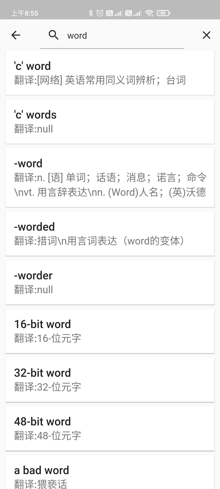
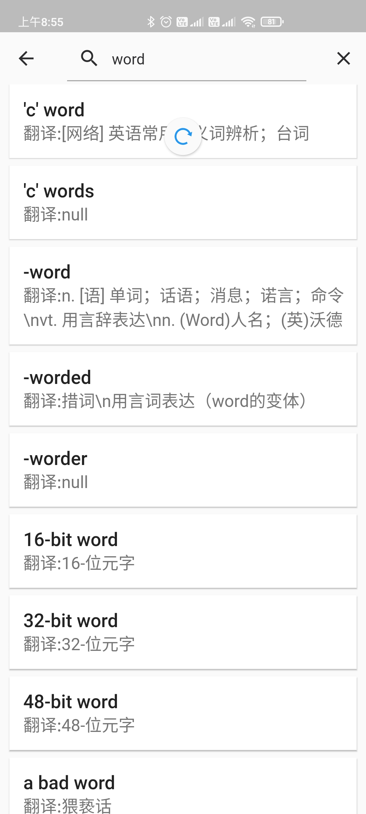
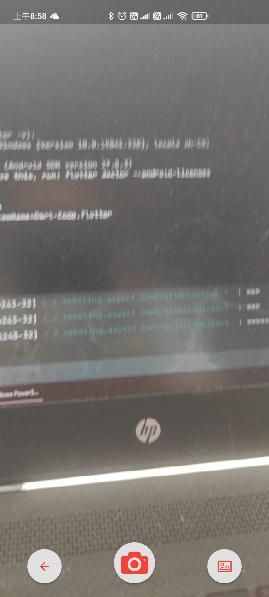
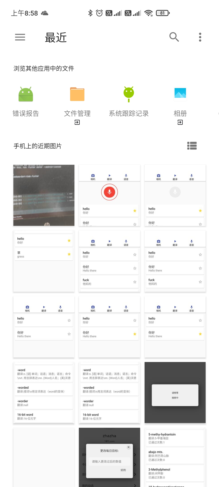
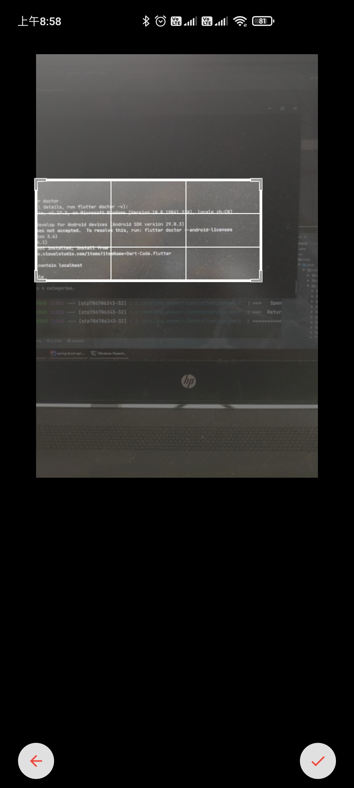
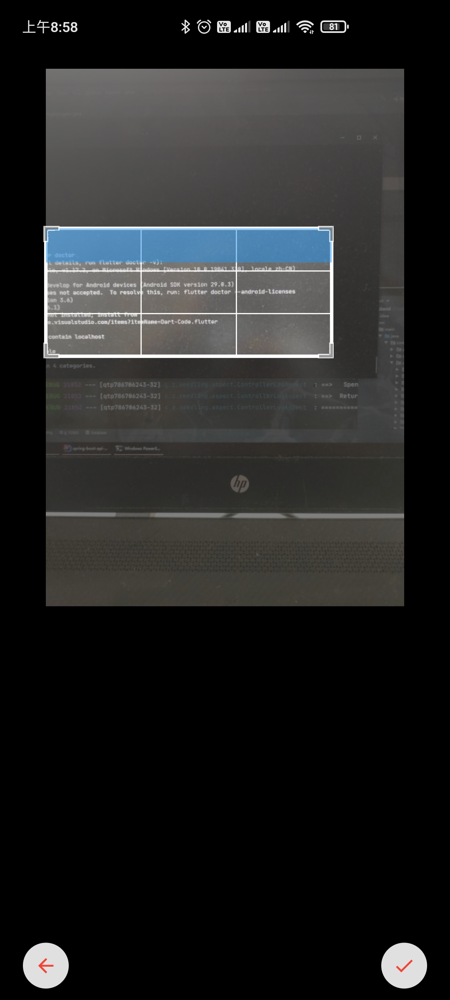
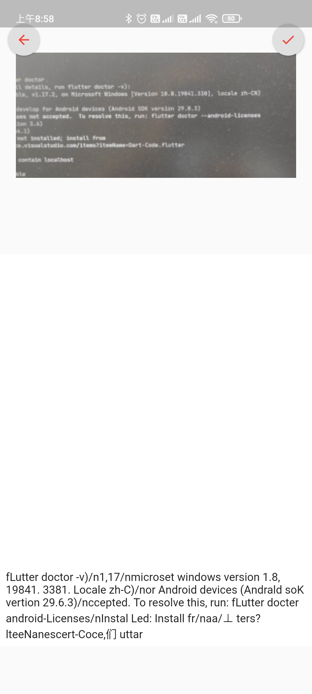

# EnglishManFlutter
 

一个简单的嘤语app

**迫于时间原因，本项目仅用时4天，各种bug懒得改，仅供参考。**

## 主要功能

### 注册登录

| 注册                                                         | 登录                                                         |
| ------------------------------------------------------------ | ------------------------------------------------------------ |
|  |  |

### 单词背诵

| 单词背诵                                                     | 单词背诵                                                     |
| ------------------------------------------------------------ | ------------------------------------------------------------ |
|  |  |

| 个人已背单词                                                 | 设置每日目标                                                 |
| ------------------------------------------------------------ | ------------------------------------------------------------ |
|  |  |

### 搜词

| 空界面                                                       | 搜索中                                                       |
| ------------------------------------------------------------ | ------------------------------------------------------------ |
|  |  |

| 搜索结果                                                     | 上拉下拉刷新                                                 |
| ------------------------------------------------------------ | ------------------------------------------------------------ |
|  |  |

### 翻译

| 翻译主界面                                                   | 收藏翻译界面                                                 |
| ------------------------------------------------------------ | ------------------------------------------------------------ |
|  |  |

| 收藏翻译                                                     | 取消收藏翻译                                                 |
| ------------------------------------------------------------ | ------------------------------------------------------------ |
|  |  |

| 英译汉                                                       | 汉译英                                                       |
| ------------------------------------------------------------ | ------------------------------------------------------------ |
|  |  |

| 语音转文字                                                   | 语音转文字                                                   |
| ------------------------------------------------------------ | ------------------------------------------------------------ |
|  |  |

| 摄像头OCR                                                    | 文件选取OCR                                                  |
| ------------------------------------------------------------ | ------------------------------------------------------------ |
|  |  |

| 选取区域                                                     | 扫描中                                                       |
| ------------------------------------------------------------ | ------------------------------------------------------------ |
|  |  |

| 扫描结果                                                     | 返回界面                                                     |
| ------------------------------------------------------------ | ------------------------------------------------------------ |
|  |  |

### 动态

| 动态界面                                                     | 动态详情                                                     |
| ------------------------------------------------------------ | ------------------------------------------------------------ |
|  |  |

| 点赞                                                         | 取消点赞                                                     |
| ------------------------------------------------------------ | ------------------------------------------------------------ |
|  |  |

| 发布动态                                                     | 我的动态                                                     |
| ------------------------------------------------------------ | ------------------------------------------------------------ |
|  |  |

## 项目结构


## 参考项目

- [单词数据库](https://github.com/skywind3000/ECDICT)
- [OCR识别](https://github.com/luyongfugx/flutter_ocr)

## 第三方库

```yaml
# 路由管理
auto_route: ^0.5.0

# 日期格式
intl: ^0.16.1

# 上下拉刷新
flutter_easyrefresh: ^2.1.0

# 骨架屏
pk_skeleton: ^0.0.2

# 提示 toast
fluttertoast: ^3.1.3

# 通讯 http
dio: ^3.0.9
cookie_jar: ^1.0.1
dio_cookie_manager: ^1.0.0

# storage + cache
shared_preferences: ^0.5.6+3
cached_network_image: ^2.0.0

# 加密安全 SHA
crypto: ^2.1.3

# 状态管理
provider: ^4.0.4

# webView
webview_flutter: ^0.3.20+2

# loading
loading_animations: ^2.1.0

# share
share: ^0.6.4

# 设备信息
device_info: ^0.4.2+3

# 包信息
package_info: ^0.4.0+18

# 路径查询
path_provider: ^1.6.8

# permission 权限
permission_handler: ^5.0.0+hotfix.6

# 安装
install_plugin: ^2.0.1

# 对话框
easy_dialog: ^1.0.5

# 错误收集
sentry: ^3.0.1

# 粘性头部
flutter_sticky_header: "^0.4.0"
# google翻译
translator: ^0.1.3
# 语音转文字
speech_to_text: 2.3.0
speech_recognition: 0.3.0+1

# 音频播放库
audioplayers: ^0.15.1

# OCR
video_player: 0.5.2
camera: 0.5.8+2
image: 2.1.12
image_picker:

# 屏幕适配
flutter_screenutil: ^1.0.2

# 路由生成
auto_route_generator: ^0.5.0
build_runner:

# icons
flutter_launcher_icons: ^0.7.5
```

## 结尾

本项目后端采用springboot+spring-security+mybatis+mysql+redis，暂不开源，有需求请邮件联系:

- [lolicoin@foxmail.com](mailto:lolicoin@foxmail.com)